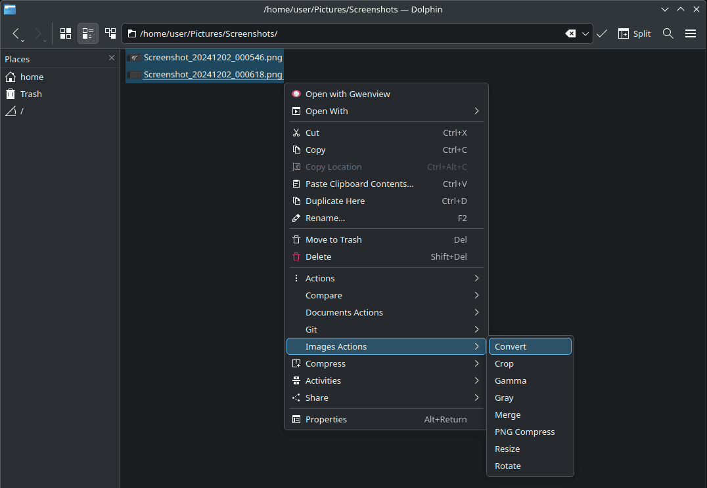

# Контекстное меню файлового менеджера Dolphin из рабочего окружения KDE

Для решения рутинных задач в файловом менеджере Dolphin, развиваемого в рамках среды рабочего стола KDE, присутствует возможность вызывать собственные сценарии из контекстного меню `servicemenus`.

Параметры хранятся в файлах `/home/<имя_пользователя>/.local/share/kio/servicemenus/<имя_файла>.desktop`  
Сценарии удобно выносить в отдельные файлы `<имя_файла_сценария>.sh`  





## Установка

1. Скачайте [архив](https://github.com/tarman3/dolphine_servicemenus/archive/refs/heads/main.zip)

2. Распакуйте файлы в каталог `$HOME/.local/share/kio/servicemenus/`

3. Назначьте файлам права на исполнение

```
chmod +x $HOME/.local/share/nemo/actions/*.sh
chmod +x $HOME/.local/share/nemo/actions/*.desktop
```

## Установка дополнительных программ

Для работы некоторых сенариев требуется установка дополнительных программ.
Пример для Archlinux:

```
sudo pacman -S bc cwebp enca jpegoptim ffmpeg imagemagick kdialog meld oxipng perl-lwp-protocol-https pngquant qpdf tesseract-ocr tesseract-ocr-deu tesseract-ocr-ita tesseract-ocr-rus unoconv wl-paste yad
```

## Список сценариев

|Файл|Описание|
|---|---|
|**delete**|Удалить средствами Secure delete|
|**docs2pdf**|Конвертировать документы в PDF|
|**git_add_commit**|Создать коммит Git|
|**git_replace_last_commit**|Заменить последний коммит Git|
|**hash**|Расчитать контрольные суммы|
|**images_convert**|Конвертировать формат изображений|
|**images_crop**|Изменить размер изображений|
|**images_gamma**|Изменить гамму изображений|
|**images_gray**|Сделать изображения чёрно-белыми|
|**images_jpg_opti**|Сжать изображения|
|**images_merge**|Объединить изображения|
|**images_png_opti**|Сжать изображения PNG|
|**images_resize**|Изменить разрешение изображений|
|**images_rotate**|Повернуть изображения|
|**images_webp_opti**|Сжать изображения WEBP|
|**media_cut**|Вырезать фрагмент мультимедиа|
|**media_cut_waste**|Отрезать начало и конец (для видео из OBS)|
|**media_process**|Изменить формат, bitrate, разрешение, кодек, поворот|
|**meld**|Сравнить файлы/каталоги по содержимому|
|**ocr**|Распознать текст программой tesseract|
|**pdf_combine**|Объединить PDF/изображения в PDF|
|**pdf_compress**|Сжать PDF|
|**pdf_convert2image**|Преобразовать страницы PDF в изображения|
|**pdf_decrypt**|Снять защиту с PDF|
|**pdf_export_images**|Извлечь изображения из PDF|
|**pdf_export_pages**|Извлечь страницы из PDF|
|**timestamp**|Добавить дату к имени файла|
|**txt_encoding**|Изменить кодировку текстовых файлов|
|**wget**|Скачать файл по ссылке из буфера обмена|

## Полезные ссылки
- [Creating Dolphin service menus](https://develop.kde.org/docs/apps/dolphin/service-menus)  
- [Shell scripting with KDE dialogs](https://develop.kde.org/docs/administration/kdialog)  
- [Yet Another Dialog](https://github.com/v1cont/yad)  
- [Nemo Actions - LinuxMint](https://github.com/demonlibra/nemo-actions)  
